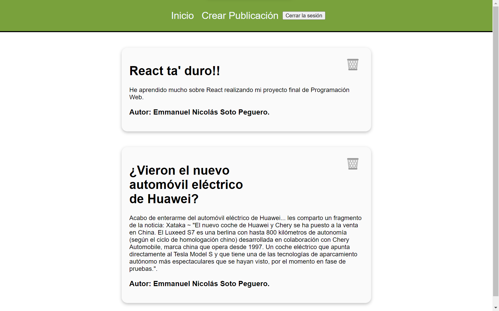

# Muro Interactivo

Este es el Proyecto Final de Emmanuel Soto, esta es la captura de pantalla:

> Muro interactivo tipo Blog realizado con JavaScript (ES6), el framework React y Firebase como tecnología para el backend.

## Proyecto Final </> Muro Interactivo:

Haga un sistema WEB que permita a los visitantes las siguientes funcionalidades:
1. Ver todas las publicaciones hechas por todos los usuarios (No requiere autenticación).
2. Crear una cuenta de usuario (del usuario se guardará: usuario, clave, nombre, apellido).
3. Iniciar Sesión.
4. Publicar nuevos posts (Solo usuarios autenticados).